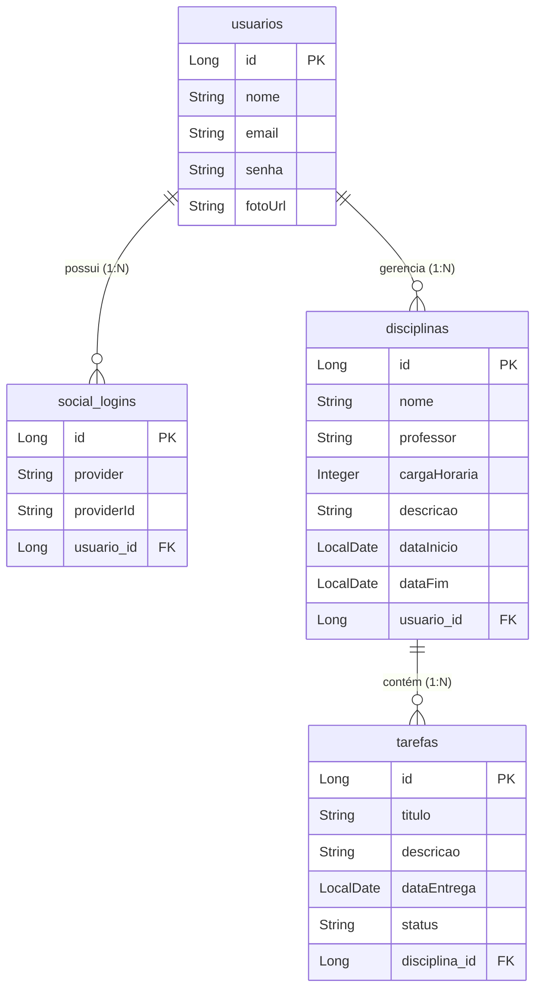

# EduTrack AI

O **EduTrack AI** é uma plataforma educacional inteligente projetada para ajudar estudantes a gerenciarem suas rotinas de estudos de forma eficiente. O sistema permite o rastreamento e organização de disciplinas e tarefas, oferecendo um Dashboard completo com métricas de desempenho. O grande diferencial é a integração com Inteligência Artificial (Google GenAI / Gemini), que analisa os dados do usuário para fornecer *insights* e dicas de estudo personalizadas, otimizando o aprendizado e a produtividade.

O projeto resolve o problema da desorganização e falta de direcionamento nos estudos, unificando a gestão de tarefas e fornecendo direcionamento inteligente baseado no progresso do aluno.

---

## 🏗️ Arquitetura e Estrutura de Pastas

O projeto adota uma arquitetura cliente-servidor tradicional, separando claramente o Frontend (Interface do Usuário) e o Backend (API e regras de negócio).

```text
EduTrack_ai/
├── backend/                # API RESTful (Java + Spring Boot)
│   ├── src/main/java/com/api/edutrack/
│   │   ├── config/         # Configurações globais (Swagger, Web, Security, etc.)
│   │   ├── controller/     # Endpoints da API (Controladores REST)
│   │   ├── dto/            # Objetos de Transferência de Dados (Data Transfer Objects)
│   │   ├── entity/         # Entidades JPA (Mapeamento do Banco de Dados)
│   │   ├── enums/          # Enumerações padronizadas
│   │   ├── exception/      # Tratamento global de exceções
│   │   ├── repository/     # Interfaces de acesso ao banco (Spring Data JPA)
│   │   ├── security/       # Configurações de autenticação e filtros JWT
│   │   └── service/        # Regras de negócio e lógica de aplicação
│   └── src/main/resources/ # Arquivos de propriedades e configurações do ambiente
│
└── frontend/               # Aplicação SPA (React + Vite)
    ├── src/
    │   ├── componentes/    # Componentes React reutilizáveis
    │   ├── layouts/        # Layouts estruturais das páginas
    │   ├── services/       # Configuração do Axios e chamadas à API
    │   ├── telas/          # Páginas da aplicação (Views/Screens)
    │   ├── App.jsx         # Componente raiz e roteamento
    │   └── main.jsx        # Ponto de entrada do React
```

---

## 🗄️ Modelagem do Banco de Dados (DER)

Abaixo está o Diagrama de Entidade-Relacionamento (DER) que representa as principais tabelas do sistema, seus atributos e a cardinalidade dos relacionamentos:



---

## 🚀 Tecnologias Utilizadas

### Backend
* **Java 17** e **Spring Boot 4.0.5**
* **Spring Data JPA**: Para persistência e mapeamento objeto-relacional.
* **Spring Security** e **OAuth2 Client**: Para segurança da API e Social Login (Google).
* **JJWT (JSON Web Token)**: Para autenticação e autorização via tokens.
* **MySQL Connector**: Driver para conexão com banco de dados MySQL.
* **Lombok**: Para redução de código boilerplate.
* **SpringDoc OpenAPI (Swagger)**: Para documentação interativa da API.
* **Google GenAI SDK**: Para integração com a IA do Google (Gemini) e geração de Insights.

### Frontend
* **React 19** e **Vite**: Para construção de uma Single Page Application rápida e moderna.
* **React Router DOM**: Para gerenciamento de rotas.
* **Axios**: Para consumo da API REST.
* **Recharts**: Para renderização de gráficos de desempenho no Dashboard.
* **React OAuth Google**: Para integração do fluxo de login social do lado do cliente.

---

## 🔄 Fluxo de Funcionamento Principal

1. **Autenticação**: O usuário acessa a plataforma e pode criar uma conta usando e-mail/senha ou fazer Login Social via Google.
2. **Sessão JWT**: O Backend valida as credenciais e retorna um Token JWT, que é armazenado pelo Frontend e injetado nos cabeçalhos (`Authorization: Bearer <token>`) de todas as requisições subsequentes usando interceptadores do Axios.
3. **Gestão de Estudos**: O usuário cadastra suas Disciplinas e vincula Tarefas a elas. Todas as operações interagem com a API REST que persiste os dados no MySQL.
4. **Dashboard**: Ao acessar a página principal, o Frontend busca os dados do `DashboardController` para montar gráficos de progresso usando a biblioteca `Recharts`.
5. **Geração de Insights**: O usuário acessa a tela de Insights. O Frontend faz uma requisição ao Backend. O `InsightsController` pega o contexto do usuário (disciplinas, tarefas concluídas e pendentes) e constrói um prompt que é enviado à API do Google Gemini. O modelo processa essas informações e retorna conselhos de estudo personalizados para o Frontend exibir.

---

## 🛠️ Guia de Instalação e Execução

### Pré-requisitos
* Java JDK 17
* Node.js (v18+)
* Banco de Dados MySQL rodando localmente (porta 3306)

### 1. Configurando o Banco de Dados
Crie um banco de dados no seu MySQL chamado `edutrack_db`:
```sql
CREATE DATABASE edutrack_db;
```

### 2. Configurando e Executando o Backend
1. Navegue até a pasta do backend:
   ```bash
   cd backend
   ```
2. Crie ou renomeie o arquivo `src/main/resources/application.properties_example` para `application.properties`.
3. Preencha as variáveis de ambiente necessárias no arquivo `application.properties`:
   * Credenciais do seu MySQL (`spring.datasource.username` e `password`)
   * Sua Chave de API do Google Gemini (`gemini.api.key`)
   * Credenciais do Google OAuth2 (`client-id` e `client-secret`)
4. Execute o projeto usando o Maven Wrapper:
   ```bash
   # No Windows (PowerShell/CMD):
   ./mvnw.cmd spring-boot:run
   
   # No Linux/Mac:
   ./mvnw spring-boot:run
   ```
   *A API iniciará por padrão em `http://localhost:8080`.*

### 3. Configurando e Executando o Frontend
1. Abra um novo terminal e navegue até a pasta do frontend:
   ```bash
   cd frontend
   ```
2. Crie um arquivo `.env` na raiz da pasta `frontend` e defina o Client ID do Google:
   ```env
   VITE_GOOGLE_CLIENT_ID=seu-client-id-do-google
   ```
3. Instale as dependências:
   ```bash
   npm install
   ```
4. Inicie o servidor de desenvolvimento:
   ```bash
   npm run dev
   ```
   *A aplicação iniciará (geralmente em `http://localhost:5173` ou porta similar indicada no terminal).*

---

## 📚 Referência da API / Principais Módulos

Após iniciar o Backend, você pode acessar a documentação interativa completa da API via Swagger no seguinte endereço:  
**http://localhost:8080/swagger-ui/index.html** (ou `/swagger-ui.html`)

### Principais Módulos da API (Controllers)
* **`AuthController`**: Responsável pela camada de segurança de entrada. Trata o registro de novos usuários, login com credenciais locais e integração com o Google OAuth2. Emite os Tokens JWT.
* **`DashboardController`**: Agrega dados e retorna estatísticas, quantitativos gerais e métricas necessárias para alimentar os gráficos do painel inicial do usuário.
* **`DisciplinaController`**: Módulo de CRUD (Create, Read, Update, Delete) para o gerenciamento das disciplinas em que o aluno está matriculado.
* **`TarefaController`**: Módulo de CRUD para as atividades e trabalhos do aluno. Permite o vínculo opcional de tarefas a disciplinas específicas e o controle de status (pendente, em andamento, concluído).
* **`UsuarioController`**: Responsável pela visualização e atualização dos dados de perfil do usuário.
* **`InsightsController`**: Concentra a integração de IA. Recebe a requisição, formata o histórico e comportamento do aluno e se comunica com o SDK do Google GenAI para devolver o resultado formatado.
